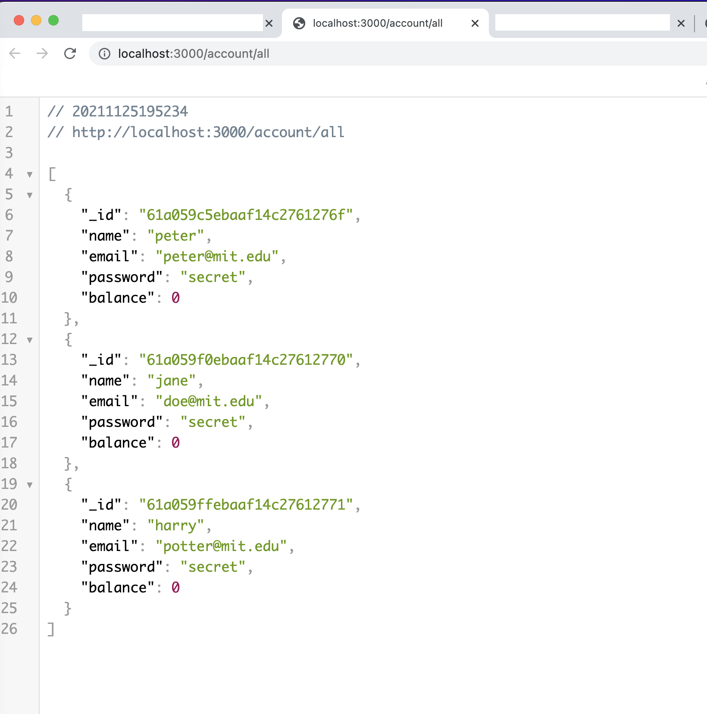

# Full-Stack Banking Application

This application was part of the MIT xPro Full Stack Development with MERN Course. This is a full-stack web application that uses the MERN stack. It integrates ReactJS with a back-end Express API. The application uses a Data Abstraction Layer (DAL) with MongoDB.

## How to Run

- [Clone this GitHub repo.](https://docs.github.com/en/github/creating-cloning-and-archiving-repositories/cloning-a-repository-from-github/cloning-a-repository)

- cd into the project folder and run

```
npm install
```

You'll need to have Docker installed and running on your machine. Run the following command in your terminal:

```
docker run -p 27017:27017 --name badbank -d mongo
```

You can check that the MongoDB Docker container is running by going to: localhost:27017 

You can test MongoDB by running:

```
node mongo_test.js
```

You can use [Robo T3](https://robomongo.org/download) to browse your MondoDB database. When you open Robo T3, create a connection (default settings). You should see 'myproject' and your database there.

You can now start up the local server by running the following command in the terminal:
```
node index.js
```

- You can goto localhost:3000 to view the frontend of app. 

## Screenshots



## Technology Used

- ReactJS
- Express Server
- MongoDB
- Docker
- Robo T3

## Features

Currently, you can add a user to the MongoDB through the url. You can also view all users in the database by passing the request through the url. I'd like to integrate what I've done with the frontend so that users can use navigation to make api calls. I'd also like to include authentication with this app.

## License Information

MIT License

Copyright (c) 2021 Catherine Chanse

Permission is hereby granted, free of charge, to any person obtaining a copy of this software and associated documentation files (the "Software"), to deal in the Software without restriction, including without limitation the rights to use, copy, modify, merge, publish, distribute, sublicense, and/or sell copies of the Software, and to permit persons to whom the Software is furnished to do so, subject to the following conditions:

The above copyright notice and this permission notice shall be included in all copies or substantial portions of the Software.

THE SOFTWARE IS PROVIDED "AS IS", WITHOUT WARRANTY OF ANY KIND, EXPRESS OR IMPLIED, INCLUDING BUT NOT LIMITED TO THE WARRANTIES OF MERCHANTABILITY, FITNESS FOR A PARTICULAR PURPOSE AND NONINFRINGEMENT. IN NO EVENT SHALL THE AUTHORS OR COPYRIGHT HOLDERS BE LIABLE FOR ANY CLAIM, DAMAGES OR OTHER LIABILITY, WHETHER IN AN ACTION OF CONTRACT, TORT OR OTHERWISE, ARISING FROM, OUT OF OR IN CONNECTION WITH THE SOFTWARE OR THE USE OR OTHER DEALINGS IN THE SOFTWARE.
